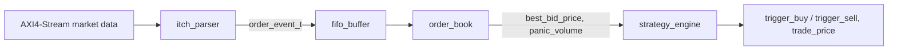
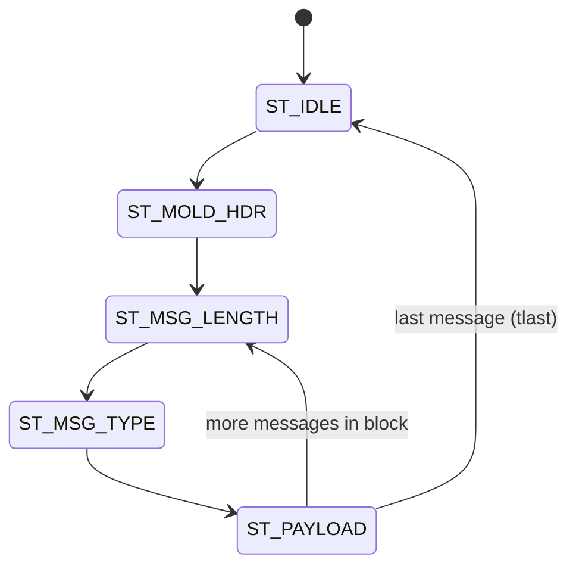
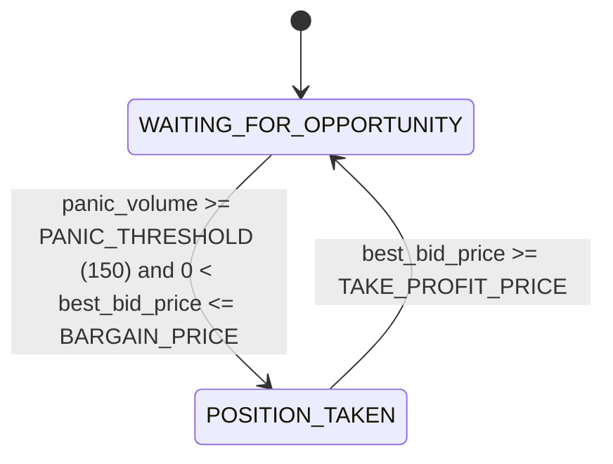

# HFT Market-Data Pipeline — SystemVerilog

A small, from-scratch hardware pipeline that mirrors the core building blocks of a real high-frequency-trading feed handler: it parses a binary market-data stream, maintains a live limit order book, and drives a simple trading strategy — entirely in synthesizable SystemVerilog.

This is a personal / educational project, not a production trading system. See [Known Limitations](#known-limitations--possible-extensions) for an honest list of what it does and doesn't handle.

## Overview

The pipeline ingests a byte stream — framed the way real exchange market-data feeds are — over an AXI4-Stream interface, parses individual messages, updates a resting-order book, and emits buy/sell signals based on order-flow activity:

| Module | File | Role |
|---|---|---|
| `itch_parser` | `itch_parser.sv` | Byte-level FSM decoding ITCH-style messages from an AXI4-Stream byte stream |
| `itch_pkg` | `itch_pkg.sv` | Shared message/event type definitions |
| `fifo_buffer` | `fifo_buffer.sv` | Parameterized synchronous FIFO decoupling parser and book |
| `order_book` | `order_book.sv` | Maintains resting bid orders and the best bid price/volume |
| `strategy_engine` | `strategy_engine.sv` | Simple mean-reversion FSM generating trade signals |
| `hft_top` | `hft_top.sv` | Top-level module wiring the pipeline together |

## Module Details

### `itch_parser`

Consumes an AXI4-Stream byte stream (`s_axis_tdata` / `tvalid` / `tlast`, `s_axis_tready`) framed the way real ITCH feeds are: a Mold-style session header carrying a message count, followed by repeated `[length][type][payload]` blocks.

State machine:

Recognizes two ITCH 5.0 message types:
- **Add Order** (`0x41` / `'A'`) — shifted into a 288-bit buffer sized to exactly match the Add Order struct width, then latched as `parsed_order`.
- **Order Delete** (`0x44` / `'D'`) — latched as `parsed_delete`.

### `itch_pkg`

Shared message and event type definitions. Field layouts mirror the real NASDAQ TotalView-ITCH 5.0 spec:

**`itch_add_order_t`**

| Field | Width | Notes |
|---|---|---|
| `msg_type` | 8 | `'A'` |
| `stock_locate` | 16 | |
| `tracking_number` | 16 | |
| `timestamp` | 48 | |
| `order_ref_num` | 64 | |
| `buy_sell_indicator` | 8 | `'B'` = buy, `'S'` = sell |
| `shares` | 32 | |
| `stock` | 64 | |
| `price` | 32 | |

**`itch_delete_order_t`**: `msg_type`, `stock_locate`, `tracking_number`, `timestamp`, `order_ref_num`.

`order_event_t` tags one of the two payloads above with an `evt_type_t` (`EVT_NONE` / `EVT_ADD` / `EVT_DELETE`).

### `fifo_buffer`

A generic synchronous FIFO (`DEPTH`, `PTR_W` parameters) using a binary read/write pointer plus an extra wrap bit for full/empty detection. Buffers `order_event_t` items between the parser and the order book so the two stages can run at slightly different paces.

### `order_book`

Tracks the **bid side** of the book:
- `mem_a_orders[256]` — open orders, indexed by the low byte of `order_ref_num`, storing `{price, shares}`.
- `mem_b_levels[256]` — aggregated resting volume per price, indexed by the low byte of `price`.
- `best_bid_price` / `best_bid_volume` update incrementally on every Add / Delete.
- When a Delete empties the current best level, a dedicated `ST_SEARCH` state walks price levels downward until it finds the next non-empty one (or bottoms out at 0).
- `panic_volume` accumulates shares from "large" cancellations (`> 50` shares) — a crude order-flow-stress signal, fed to the strategy engine.

### `strategy_engine`

A two-state FSM implementing a simple contrarian / mean-reversion rule:

Buys when a burst of large cancellations coincides with a low price, then sells once price recovers to a take-profit level.

### `hft_top`

Wires `itch_parser → fifo_buffer → order_book → strategy_engine` into a single top-level module.

## Known Limitations & Possible Extensions

This is a learning project, so scope was kept deliberately small. Roughly easiest-to-fix first:

- **Bid-side only** — the book doesn't track offers. A mirrored `best_ask` path would make it a real two-sided book.
- **Truncated indexing** — `order_ref_num[7:0]` and `price[7:0]` are used directly as memory indices, so at scale, different orders/prices can alias to the same slot. A hash table or wider address space would remove this.
- **No real backpressure** — `s_axis_tready` is tied high, so the parser can't stall the upstream source.
- **Single clock domain** — `fifo_buffer` is a synchronous FIFO, not a CDC-safe asynchronous one; fine as long as the whole design shares one clock.

## Author

Michał Cedro
